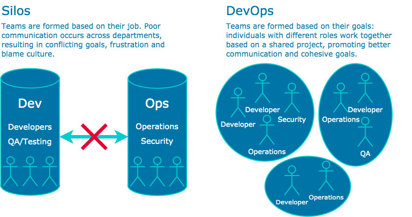

# What is DevOps
DevOps cultural approach to software development project structure with a particular philosophy designed to achieve the following things:

- Increased collaboration
- Reduction in silos
- Shared responsibility
- Autonomous teams
- Increase in quality
- Valuing feedback
- Increase in automation

## Why DevOps?
The following image shows how companies traditionally worked and how companies that implement DevOps work now. The main aim is to increase collaboration and produce a better product.

## Pillars of DevOps
- Collaboration - Development and operations teams coalesce into a functional team that communicates, shares feedback, and collaborates throughout the entire development and deployment cycle. 
- Automation - Automate as much of the SDLC as possible
- Continious Improvement - Focusing on experimentation, minimizing waste, and optimizing for speed, cost, and ease of delivery. 
- Customer centric action - DevOps teams use short feedback loops with customers and end users to develop products and services centered around user needs.
- Create with the end in mind - This principle involves understanding the needs of customers and creating products or services that solve real problems.

## Benefits of DevOps
- Ease of use
- Flexibile
- Robustness - faster release of software
- Cost effective
- Renews focus on the customers.
- Unites teams for faster product shipments.
- Simplifies development focus.
- Introduces automation to the development process.
- Supports end-to-end responsibility.

## What is a development environment? Why is it needed?

A development environment is a workspace for developers to make changes to code without breaking anything in a live environment

Companies need a development environment as it is great for streamlined workflows and reduing potenitial errors. It is also needed as a company can make changes to the code or product without the end user noticing before deploying it to the live environment.

## Common linux commands
- Update ubuntu `sudo apt-get update -y`
- Upgrade ubuntu `sudo apt-get upgrade -y`
- Install nginx `sudo apt-get install nginx -y`
- Check status of nginx `systemctl status nginx`
> nginx is used as an example, can be any compatable package, just change nginx in command for the relevant package name.
- Who am I `uname` or `uname -a`
- Where am i  `pwd`
- Create folder in linux = `mkdir dir-name`
- How to check folder/files etc = `ls`
- How to check hidden folders `ls -a`
- Change directory `cd nameof-dir`
- Back out one step from current location ` cd ..`
- Create a file `touch filename` or `nano filename`
- Move test.txt from current location to devops folder `mv - test.txt devops`
- Copy paste `cp path_of_data path_of_destination`
> May need to use sudo at the beginning of the command if permission is denied. This allows admin access which may be needed to run commands

## File permissions
- READ `r` WRITE `w` EXECUTE `x`
- How to check file permission `ll`
- Change permissions `chmod permission file_name`

 
## chmod Absolute Mode

• Uses octal numbers. 

- 4 = read 
- 2 = write 
- 1 = execute 

• Add numbers of permissions you wish to grant. 

- Sum of these is what you provide. 
- Read, write, execute is 7 (4 + 2 + 1). 
- Read, write is 6 (4 + 2). 

• Complete permissions are expressed as three-digit number. 

- Each digit corresponds to a context (owner, group, other).

• E.g. chmod 764 file1 (user = rwx, group = rw and others = read on file1)

chmod 700 file1 (user = rwx)

chmod 640 file1 (user = rw, group = r)

## Bash scripting
- Create a file called provision.sh within the VM
- Change permission of this file `sudo chmod +x provision.sh` - This makes the file executable
- First line MUST BE starting with `#!/bin/bash`
- Update ubuntu
- Upgrade ubuntu 
- Install nginx
- Start nginx
- `enable nginx`
- Stopped then started
- To run the script `sudo./provision.sh`
> If the script file is elsewhere you would need to provide the absolute path.
> This is known as provisioning

### On local machine

Create a file called file.sh which has the same contents as the provision.sh file on the VM

In Vagrantfile
- To add an external script to run on vagrant up:

  `config.vm.provision "file", source: "./file.sh", destination: "$HOME/"`
> This will essentially transfer the file.sh file from the local machine to the vm. More info avaliable in the Vagrant website for documentation

> This command can be commented outfor task 2

- Change permissions of file to executable:

  `config.vm.provision "shell",
    inline: "sudo chmod +x file.sh && sudo ./file.sh", run: "always"`
> This will change the file.sh permission to make it executable.

These 2 steps should allow you to access the nginx page without having to ssh into the vm

### Installing nodejs v6 and npm

- Install Nodejs v6

    `curl -sL https://deb.nodesource.com/setup_6.x | sudo -E bash -`

    `sudo apt-get install nodejs -y`

- Install pm2

    `sudo npm install pm2 -g`

- Install python software properties

    `sudo apt-get install python-software-properties`

### Copy app from localhost to the VM

- copy the app to the VM. In the vagrant file put 

`config.vm.synced_folder ".", "/home/vagrant/app"`

vagrant reload to apply the changes

## Task 2

commands to add to the bottom of provision.sh or file.sh based on what you name the file. Commands must be in order

- Install Nodejs v6

    `curl -sL https://deb.nodesource.com/setup_6.x | sudo -E bash -`

    `sudo apt-get install nodejs -y`

- Install pm2
    
    `sudo npm install pm2 -g`

- Install python software properties
    
    `sudo apt-get install python-software-properties -y`

- Change directory into the folder which contains the package.json file

    `cd app/app/app/app`
    > Will be different dependant on file structure.

- Install npm
    
    `npm install -d`

- Start npm

    `npm start -d`

Once these commands have been run on vagrant up, you should be able to navigate to port 3000 and see the relative page dependant on the app.

