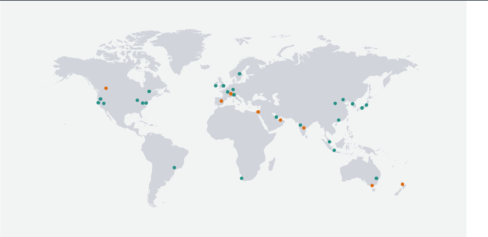

# What is DevOps
DevOps cultural approach to software development project structure with a particular philosophy designed to achieve the following things:

- Increased collaboration
- Reduction in silos
- Shared responsibility
- Autonomous teams
- Increase in quality
- Valuing feedback
- Increase in automation

## Why DevOps?
The following image shows how companies traditionally worked and how companies that implement DevOps work now. The main aim is to increase collaboration and produce a better product.

## Pillars of DevOps
- Collaboration - Development and operations teams coalesce into a functional team that communicates, shares feedback, and collaborates throughout the entire development and deployment cycle. 
- Automation - Automate as much of the SDLC as possible
- Continious Improvement - Focusing on experimentation, minimizing waste, and optimizing for speed, cost, and ease of delivery. 
- Customer centric action - DevOps teams use short feedback loops with customers and end users to develop products and services centered around user needs.
- Create with the end in mind - This principle involves understanding the needs of customers and creating products or services that solve real problems.

## Benefits of DevOps
- Ease of use
- Flexibile
- Robustness - faster release of software
- Cost effective
- Renews focus on the customers.
- Unites teams for faster product shipments.
- Simplifies development focus.
- Introduces automation to the development process.
- Supports end-to-end responsibility.

## What is a development environment? Why is it needed?

A development environment is a workspace for developers to make changes to code without breaking anything in a live environment

Companies need a development environment as it is great for streamlined workflows and reduing potenitial errors. It is also needed as a company can make changes to the code or product without the end user noticing before deploying it to the live environment.

## Common linux commands
- Update ubuntu `sudo apt-get update -y`
- Upgrade ubuntu `sudo apt-get upgrade -y`
- Install nginx `sudo apt-get install nginx -y`
- Check status of nginx `systemctl status nginx`
> nginx is used as an example, can be any compatable package, just change nginx in command for the relevant package name.
- Who am I `uname` or `uname -a`
- Where am i  `pwd`
- Create folder in linux = `mkdir dir-name`
- How to check folder/files etc = `ls`
- How to check hidden folders `ls -a`
- Change directory `cd nameof-dir`
- Back out one step from current location ` cd ..`
- Create a file `touch filename` or `nano filename`
- Move test.txt from current location to devops folder `mv - test.txt devops`
- Copy paste `cp path_of_data path_of_destination`
> May need to use sudo at the beginning of the command if permission is denied. This allows admin access which may be needed to run commands

## File permissions
- READ `r` WRITE `w` EXECUTE `x`
- How to check file permission `ll`
- Change permissions `chmod permission file_name`

 
## chmod Absolute Mode

• Uses octal numbers. 

- 4 = read 
- 2 = write 
- 1 = execute 

• Add numbers of permissions you wish to grant. 

- Sum of these is what you provide. 
- Read, write, execute is 7 (4 + 2 + 1). 
- Read, write is 6 (4 + 2). 

• Complete permissions are expressed as three-digit number. 

- Each digit corresponds to a context (owner, group, other).

• E.g. chmod 764 file1 (user = rwx, group = rw and others = read on file1)

chmod 700 file1 (user = rwx)

chmod 640 file1 (user = rw, group = r)

## Bash scripting
- Create a file called provision.sh within the VM
- Change permission of this file `sudo chmod +x provision.sh` - This makes the file executable
- First line MUST BE starting with `#!/bin/bash`
- Update ubuntu
- Upgrade ubuntu 
- Install nginx
- Start nginx
- `enable nginx`
- Stopped then started
- To run the script `sudo./provision.sh`
> If the script file is elsewhere you would need to provide the absolute path.
> This is known as provisioning

### On local machine

Create a file called file.sh which has the same contents as the provision.sh file on the VM

In Vagrantfile
- To add an external script to run on vagrant up:

  `config.vm.provision "file", source: "./file.sh", destination: "$HOME/"`
> This will essentially transfer the file.sh file from the local machine to the vm. More info avaliable in the Vagrant website for documentation

> This command can be commented outfor task 2

- Change permissions of file to executable:

  `config.vm.provision "shell",
    inline: "sudo chmod +x file.sh && sudo ./file.sh", run: "always"`
> This will change the file.sh permission to make it executable.

These 2 steps should allow you to access the nginx page without having to ssh into the vm

### Installing nodejs v6 and npm

- Install Nodejs v6

    `curl -sL https://deb.nodesource.com/setup_6.x | sudo -E bash -`

    `sudo apt-get install nodejs -y`

- Install pm2

    `sudo npm install pm2 -g`

- Install python software properties

    `sudo apt-get install python-software-properties`

### Copy app from localhost to the VM

- copy the app to the VM. In the vagrant file put 

`config.vm.synced_folder ".", "/home/vagrant/app"`

vagrant reload to apply the changes

## Task 2

commands to add to the bottom of provision.sh or file.sh based on what you name the file. Commands must be in order

- Install Nodejs v6

    `curl -sL https://deb.nodesource.com/setup_6.x | sudo -E bash -`

    `sudo apt-get install nodejs -y`

- Install pm2
    
    `sudo npm install pm2 -g`

- Install python software properties
    
    `sudo apt-get install python-software-properties -y`

- Change directory into the folder which contains the package.json file

    `cd app/app/app/app`
    > Will be different dependant on file structure.

- Install npm
    
    `npm install -d`

- Start npm

    `npm start -d`

Once these commands have been run on vagrant up, you should be able to navigate to port 3000 and see the relative page dependant on the app.

## Creating variables in linux

### Basic variable commands
- `VARIABLE_NAME=Variable_Value` - This will set a vraiable e.g MY_NAME=Akshay
- `echo $MY_NAME` - This will show the variable name in the temrinal
- `env` - This shows all the environment variables avaliable to us
- `export MY_NAME=Akshay` This will set the environment variable in the session  

### How to make an environment variable persistent in Linux Ubuntu

- `sudo nano ~/.bashrc`
- `export [VARIABLE_NAME]=[variable_value]` - e.g. EXAMPLE="This is an example" -  at the bottom of the file
- `CTRL + X then Y`  to save the file
- `source ~/.bashrc` - so we dont have to restart the virtual machine
- `printenv VARIABLE_NAME` e.g printenv EXAMPLE - This is to see if the variable has been stored properly.

How to unset a variable in Linux Ubuntu
- `unset [VARIABLE_NAME]`

### Reverse proxy with nginx (Manual)
- When the app is up and running cd to the app folder on the VM and cd into `/etc/nginx/sites-available` and run `ls` - This should show a default file

- `sudo nano /etc/nginx/sites-available/default` to enter the file

- In the server block there should be a location block (the one which is not commented out).

- Replace the contents of that location block with the following code (Dont remove the { })
-       proxy_pass http://localhost:8080;
        proxy_http_version 1.1;
        proxy_set_header Upgrade $http_upgrade;
        proxy_set_header Connection 'upgrade';
        proxy_set_header Host $host;
        proxy_cache_bypass $http_upgrade;

- REPLACE THE PORT NUMBER ON THE FIRST LINE WITH THE PORT NUMBER OF THE APP YOU ARE RUNNING e.g 3000 instead of 8080 (The app I am running is on port 3000)

- Save the file

- Run the command `sudo nginx -t` - To ensure there are no syntax errors

- `sudo systemctl restart nginx` - restart nginx and hopefully set up reverse proxy

- Go to browser and type in ip and port number to se if app is working, then type in the ip without the port number and the app should appear.

More information on setting up reverse proxy for the app we are using (Step 5 onwards for reverse proxy): https://www.digitalocean.com/community/tutorials/how-to-set-up-a-node-js-application-for-production-on-ubuntu-16-04

### How to check process is running in linux
- `top` or `ps aux`- to see processes running 
- `sudo kill process-id` - kills the process specified
- How to use piping `|` - this helps to sort out or short list process
- How to use `head` and `tail` - to look at file from top or bottom with piping

## Create another vm for MongoDB and configure it.
- Create another VM for our database which is MongoDB
- Ubuntu 16.04 - use the same box as app
- Configure and install MongoDB with correct version
- Allow the required access, allow ip of app machine to connect to our database
- in app machine by creatnig ENV variable called DB_HOST
- cd /etc
- sudo nano mongod.conf - by default it allows access to 127.0.0.1 with port 27017
- edit mongod.conf to allow app ip or for ease of use to allow all but thats not best practice for production env
- 0.0.0.0
- restart and enable mongodb

## Common errors
- DB_HOST not found - this needs to be created in the app machine not the db machine
- when ssh'ing into machine when there are more than one. To get into the right VM use: `vagrant ssh machinename`

- edit the default file and insert the code to redirect the traffic
- delete the file and replace with pre configured data
- sudo rm -rf default
- cp or ln default from the local host to the default location of proxy file
- test it sudo nginx -t
- restart and enable

### troubleshooting with vagrant

- `ls -a` in local host, should be a .vagrant folder, if there are errors and you cant end up fixing it, delete the .vagrant file
- option 2 open virtual box, right click on 3 lines, close, power off, right click again, remove

## Setting up a second virtual machine for mongodb
go to vagrant file and add a second machine like below, first machine is the app machine we had already, the second one is the new db machine

-   Vagrant.configure("2") do |config|
  
        config.vm.define "app" do |app|
            app.vm.box = "ubuntu/xenial64"
            
            app.vm.network "private_network", ip: "192.168.10.100"
            app.vm.provision "file", source: "./file.sh", destination: "$HOME/"
            app.vm.provision "file", source: "./default", destination: "$HOME/" 
            app.vm.provision "shell",
            path: "./file.sh", run: "always"
            app.vm.synced_folder "./app", "/home/vagrant/app"

  end

-         config.vm.define "db" do |db|
            db.vm.box = "ubuntu/xenial64"
            db.vm.network "private_network", ip: "192.168.10.150"

  end
end

### Connecting mongodb machine to app machine 
once both machines running ssh into app machine
- `npm start`
- come out of app ctrl + c
- exit
- `vagrant ssh db`

### Setting up mongodb
- `sudo apt-get update && apt-get upgrade -y`

- `sudo apt-key adv --keyserver hkp://keyserver.ubuntu.com:80 --recv D68FA50FEA312927`

- `echo "deb https://repo.mongodb.org/apt/ubuntu xenial/mongodb-org/3.2 multiverse" | sudo tee /etc/apt/sources.list.d/mongodb-org-3.2.list`

- `sudo apt-get update -y`

- `sudo apt-get update -y`

- `sudo apt-get install -y mongodb-org=3.2.20 mongodb-org-server=3.2.20 mongodb-org-shell=3.2.20 mongodb-org-mongos=3.2.20 mongodb-org-tools=3.2.20`

- `sudo systemctl restart mongod`

- `sudo systemctl enable mongod` 

- `sudo systemctl status mongod`

### Configure mongodb
- `cd /etc`
- `sudo nano mongod.conf`
- on network interface change bindip to `0.0.0.0` - only use this for a dev environment
- save the nano file
- `sudo systemctl restart mongod`
- `sudo systemctl status mongod`
- `cat mongod.conf`

GO BACK TO THE APP VM AND SSH IN
- `sudo echo "export DB_HOST=mongodb://192.168.10.150:27017/posts" >> ~/.bashrc`
- `source ~/.bashrc`
- `printenv DB_HOST`
- cd to the right app folder
- `sudo npm start` 
- - go to http://192.168.10.100:3000/posts and you should see the database info

### If you cant see the data on the browser 
- `ctrl c out of the npm command`
- `node seeds/seed.js` - database cleared
looks at something with the database
- `npm start`
- go to http://192.168.10.100:3000/posts and you should see the database info

NOW NEED TO AUTOMATE THIS

`nohup node app.js > /dev/null 2>&1 &` 
this is a command for node app maybe instead of npm start

# What is cloud computing?
- Cloud computing is the delivery of computing services including servers, storage, databases, networking, software, analytics and intelligence over the Internet (the cloud) to offer faster innovation, flexible resources and economies of scale.

### Benefits of cloud computing
- Cost effective
- More security
- High availability
- Better performance
- Scalable
- Faster than local machines
- Helps release software faster. More beneficial for the business
- Faster innovation
- More flexible resources

### Why should we use cloud computing?
- If we have a large app to deploy, its easier to deploy via the cloud rather than a local machine.
- Good disaster recovery with availabily zones.
- Different cloud models (Public, Private, Hybrid) allow for a more tailored approach.

### Monolithic Architecture
- Everything is based in one box

- Simple but has limitations and complexity
- Heavy apps can slow down the start up time
- Each update results into redeploying the full stack app
- Challenging to scale up on demand
- Fruitful for simple and lightweight apps

# AWS
Amazon Web Services (AWS) is a subsidiary of Amazon that provides on-demand cloud computing platforms to individuals, companies and governments, on a paid subscription basis. The technology allows subscribers to have at their disposal a virtual cluster of computers, available all the time, through the Internet.

This image shows the global infrastructure of AWS.

For more information on the global infrastructure image including amount of zones and locations: https://aws.amazon.com/about-aws/global-infrastructure/?pg=WIAWS

### After logging into AWS
- When you log into AWS change to Ireland in the top right of the screen.

- Good naming convention is groupname_yourname_nameoftask e.g. eng114_akshay_app

### When looking at instances

- Name: Name of the machine

- Instance ID: ID of the machine

- Instance status: Shows whether the machine is running, stopped or terminated.

- Instance type: Type of machine being used (size, disks etc)

- Availability zone: Zone the machine is located in.

- Security group name: Shows what security group the machine belongs to

## Get the node app from local host to the VM on AWS

We can use scp to transfer files from local host to VM, the command is shown below
 
`scp -i .ssh/<ssh_key_name>.pem -r path/of/local/file user@target_vm_address:target/path/`

 I copied my default file over i copied the app to help with reverse proxy

 Once file copying has been completed, go to the amazon instance and ssh into it. 

### Run the following commands
I ran these from the app folder, maybe able to run from root
- `sudo apt update -y`
- `sudo apt upgrade -y`
- `sudo apt install nginx -y`
- `sudo systemctl start nginx`
- `sudo systemctl enable nginx`
- `curl -sL https://deb.nodesource.com/setup_6.x | sudo -E bash -`
- `sudo apt install nodejs -y`
- `sudo apt install npm`
- `sudo apt install python-software-properties -y`

go back to root on vm
- `sudo cp default /etc/nginx/sites-available/`
- `sudo systemctl restart nginx`
- `sudo systemctl enable nginx`

go back to right app folder on vm
- `npm install -d`
- `npm start`

Navigate to your public IP from Amazon EC2 instance on your browser with :3000 to see if the app works and without :3000 to see if the reverse proxy works.