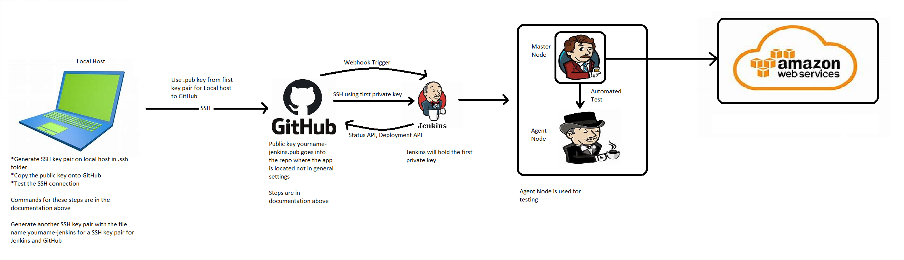

# What is DevOps
DevOps cultural approach to software development project structure with a particular philosophy designed to achieve the following things:

- Increased collaboration
- Reduction in silos
- Shared responsibility
- Autonomous teams
- Increase in quality
- Valuing feedback
- Increase in automation

## Why DevOps?
The following image shows how companies traditionally worked and how companies that implement DevOps work now. The main aim is to increase collaboration and produce a better product.


## Pillars of DevOps
- Collaboration - Development and operations teams coalesce into a functional team that communicates, shares feedback, and collaborates throughout the entire development and deployment cycle. 
- Automation - Automate as much of the SDLC as possible
- Continious Improvement - Focusing on experimentation, minimizing waste, and optimizing for speed, cost, and ease of delivery. 
- Customer centric action - DevOps teams use short feedback loops with customers and end users to develop products and services centered around user needs.
- Create with the end in mind - This principle involves understanding the needs of customers and creating products or services that solve real problems.

## Benefits of DevOps
- Ease of use
- Flexibile
- Robustness - faster release of software
- Cost effective
- Renews focus on the customers.
- Unites teams for faster product shipments.
- Simplifies development focus.
- Introduces automation to the development process.
- Supports end-to-end responsibility.

## What is a development environment? Why is it needed?

A development environment is a workspace for developers to make changes to code without breaking anything in a live environment

Companies need a development environment as it is great for streamlined workflows and reduing potenitial errors. It is also needed as a company can make changes to the code or product without the end user noticing before deploying it to the live environment.

## Common linux commands
- Update ubuntu `sudo apt-get update -y`
- Upgrade ubuntu `sudo apt-get upgrade -y`
- Install nginx `sudo apt-get install nginx -y`
- Check status of nginx `systemctl status nginx`
> nginx is used as an example, can be any compatable package, just change nginx in command for the relevant package name.
- Who am I `uname` or `uname -a`
- Where am i  `pwd`
- Create folder in linux = `mkdir dir-name`
- How to check folder/files etc = `ls`
- How to check hidden folders `ls -a`
- Change directory `cd nameof-dir`
- Back out one step from current location ` cd ..`
- Create a file `touch filename` or `nano filename`
- Move test.txt from current location to devops folder `mv - test.txt devops`
- Copy paste `cp path_of_data path_of_destination`
> May need to use sudo at the beginning of the command if permission is denied. This allows admin access which may be needed to run commands

## File permissions
- READ `r` WRITE `w` EXECUTE `x`
- How to check file permission `ll`
- Change permissions `chmod permission file_name`

 
## chmod Absolute Mode

• Uses octal numbers. 

- 4 = read 
- 2 = write 
- 1 = execute 
- ssh test
• Add numbers of permissions you wish to grant. 

- Sum of these is what you provide. 
- Read, write, execute is 7 (4 + 2 + 1). 
- Read, write is 6 (4 + 2). 

• Complete permissions are expressed as three-digit number. 

- Each digit corresponds to a context (owner, group, other).

• E.g. chmod 764 file1 (user = rwx, group = rw and others = read on file1)

chmod 700 file1 (user = rwx)

chmod 640 file1 (user = rw, group = r)

## Bash scripting
- Create a file called provision.sh within the VM
- Change permission of this file `sudo chmod +x provision.sh` - This makes the file executable
- First line MUST BE starting with `#!/bin/bash`
- Update ubuntu
- Upgrade ubuntu 
- Install nginx
- Start nginx
- `enable nginx`
- Stopped then started
- To run the script `sudo./provision.sh`
> If the script file is elsewhere you would need to provide the absolute path.
> This is known as provisioning

### On local machine

Create a file called file.sh which has the same contents as the provision.sh file on the VM

In Vagrantfile
- To add an external script to run on vagrant up:

  `config.vm.provision "file", source: "./file.sh", destination: "$HOME/"`
> This will essentially transfer the file.sh file from the local machine to the vm. More info avaliable in the Vagrant website for documentation

> This command can be commented outfor task 2

- Change permissions of file to executable:

  `config.vm.provision "shell",
    inline: "sudo chmod +x file.sh && sudo ./file.sh", run: "always"`
> This will change the file.sh permission to make it executable.

These 2 steps should allow you to access the nginx page without having to ssh into the vm

### Installing nodejs v6 and npm

- Install Nodejs v6

    `curl -sL https://deb.nodesource.com/setup_6.x | sudo -E bash -`

    `sudo apt-get install nodejs -y`

- Install pm2

    `sudo npm install pm2 -g`

- Install python software properties

    `sudo apt-get install python-software-properties`

### Copy app from localhost to the VM

- copy the app to the VM. In the vagrant file put 

`config.vm.synced_folder ".", "/home/vagrant/app"`

vagrant reload to apply the changes

## Task 2

commands to add to the bottom of provision.sh or file.sh based on what you name the file. Commands must be in order

- Install Nodejs v6

    `curl -sL https://deb.nodesource.com/setup_6.x | sudo -E bash -`

    `sudo apt-get install nodejs -y`

- Install pm2
    
    `sudo npm install pm2 -g`

- Install python software properties
    
    `sudo apt-get install python-software-properties -y`

- Change directory into the folder which contains the package.json file

    `cd app/app/app/app`
    > Will be different dependant on file structure.

- Install npm
    
    `npm install -d`

- Start npm

    `npm start -d`

Once these commands have been run on vagrant up, you should be able to navigate to port 3000 and see the relative page dependant on the app.

## Creating variables in linux

### Basic variable commands
- `VARIABLE_NAME=Variable_Value` - This will set a vraiable e.g MY_NAME=Akshay
- `echo $MY_NAME` - This will show the variable name in the temrinal
- `env` - This shows all the environment variables avaliable to us
- `export MY_NAME=Akshay` This will set the environment variable in the session  

### How to make an environment variable persistent in Linux Ubuntu

- `sudo nano ~/.bashrc`
- `export [VARIABLE_NAME]=[variable_value]` - e.g. EXAMPLE="This is an example" -  at the bottom of the file
- `CTRL + X then Y`  to save the file
- `source ~/.bashrc` - so we dont have to restart the virtual machine
- `printenv VARIABLE_NAME` e.g printenv EXAMPLE - This is to see if the variable has been stored properly.

How to unset a variable in Linux Ubuntu
- `unset [VARIABLE_NAME]`

### Reverse proxy with nginx (Manual)
- When the app is up and running cd to the app folder on the VM and cd into `/etc/nginx/sites-available` and run `ls` - This should show a default file

- `sudo nano /etc/nginx/sites-available/default` to enter the file

- In the server block there should be a location block (the one which is not commented out).

- Replace the contents of that location block with the following code (Dont remove the { })
-       proxy_pass http://localhost:8080;
        proxy_http_version 1.1;
        proxy_set_header Upgrade $http_upgrade;
        proxy_set_header Connection 'upgrade';
        proxy_set_header Host $host;
        proxy_cache_bypass $http_upgrade;

- REPLACE THE PORT NUMBER ON THE FIRST LINE WITH THE PORT NUMBER OF THE APP YOU ARE RUNNING e.g 3000 instead of 8080 (The app I am running is on port 3000)

- Save the file

- Run the command `sudo nginx -t` - To ensure there are no syntax errors

- `sudo systemctl restart nginx` - restart nginx and hopefully set up reverse proxy

- Go to browser and type in ip and port number to se if app is working, then type in the ip without the port number and the app should appear.

More information on setting up reverse proxy for the app we are using (Step 5 onwards for reverse proxy): https://www.digitalocean.com/community/tutorials/how-to-set-up-a-node-js-application-for-production-on-ubuntu-16-04

### How to check process is running in linux
- `top` or `ps aux`- to see processes running 
- `sudo kill process-id` - kills the process specified
- How to use piping `|` - this helps to sort out or short list process
- How to use `head` and `tail` - to look at file from top or bottom with piping

## Create another vm for MongoDB and configure it.
- Create another VM for our database which is MongoDB
- Ubuntu 16.04 - use the same box as app
- Configure and install MongoDB with correct version
- Allow the required access, allow ip of app machine to connect to our database
- in app machine by creatnig ENV variable called DB_HOST
- cd /etc
- sudo nano mongod.conf - by default it allows access to 127.0.0.1 with port 27017
- edit mongod.conf to allow app ip or for ease of use to allow all but thats not best practice for production env
- 0.0.0.0
- restart and enable mongodb

## Common errors
- DB_HOST not found - this needs to be created in the app machine not the db machine
- when ssh'ing into machine when there are more than one. To get into the right VM use: `vagrant ssh machinename`

- edit the default file and insert the code to redirect the traffic
- delete the file and replace with pre configured data
- sudo rm -rf default
- cp or ln default from the local host to the default location of proxy file
- test it sudo nginx -t
- restart and enable

### troubleshooting with vagrant

- `ls -a` in local host, should be a .vagrant folder, if there are errors and you cant end up fixing it, delete the .vagrant file
- option 2 open virtual box, right click on 3 lines, close, power off, right click again, remove

## Setting up a second virtual machine for mongodb
go to vagrant file and add a second machine like below, first machine is the app machine we had already, the second one is the new db machine

-   Vagrant.configure("2") do |config|
  
        config.vm.define "app" do |app|
            app.vm.box = "ubuntu/xenial64"
            
            app.vm.network "private_network", ip: "192.168.10.100"
            app.vm.provision "file", source: "./file.sh", destination: "$HOME/"
            app.vm.provision "file", source: "./default", destination: "$HOME/" 
            app.vm.provision "shell",
            path: "./file.sh", run: "always"
            app.vm.synced_folder "./app", "/home/vagrant/app"

  end

-         config.vm.define "db" do |db|
            db.vm.box = "ubuntu/xenial64"
            db.vm.network "private_network", ip: "192.168.10.150"

  end
end


### Connecting mongodb machine to app machine 
once both machines running ssh into app machine
- `npm start`
- come out of app ctrl + c
- exit
- `vagrant ssh db`

### Setting up mongodb
- `sudo apt-get update && apt-get upgrade -y`

- `sudo apt-key adv --keyserver hkp://keyserver.ubuntu.com:80 --recv D68FA50FEA312927`

- `echo "deb https://repo.mongodb.org/apt/ubuntu xenial/mongodb-org/3.2 multiverse" | sudo tee /etc/apt/sources.list.d/mongodb-org-3.2.list`

- `sudo apt-get update -y`

- `sudo apt-get update -y`

- `sudo apt-get install -y mongodb-org=3.2.20 mongodb-org-server=3.2.20 mongodb-org-shell=3.2.20 mongodb-org-mongos=3.2.20 mongodb-org-tools=3.2.20`

- `sudo systemctl restart mongod`

- `sudo systemctl enable mongod` 

- `sudo systemctl status mongod`

### Configure mongodb
- `cd /etc`
- `sudo nano mongod.conf`
- on network interface change bindip to `0.0.0.0` - only use this for a dev environment
- save the nano file
- `sudo systemctl restart mongod`
- `sudo systemctl status mongod`
- `cat mongod.conf`

GO BACK TO THE APP VM AND SSH IN
- `sudo echo "export DB_HOST=mongodb://192.168.10.150:27017/posts" >> ~/.bashrc`
- `source ~/.bashrc`
- `printenv DB_HOST`
- cd to the right app folder
- `sudo npm start` 
- - go to http://192.168.10.100:3000/posts and you should see the database info

### If you cant see the data on the browser 
- `ctrl c out of the npm command`
- `node seeds/seed.js` - database cleared
looks at something with the database
- `npm start`
- go to http://192.168.10.100:3000/posts and you should see the database info

NOW NEED TO AUTOMATE THIS

`nohup node app.js > /dev/null 2>&1 &` 
Run this command 


# What is cloud computing?
- Cloud computing is the delivery of computing services including servers, storage, databases, networking, software, analytics and intelligence over the Internet (the cloud) to offer faster innovation, flexible resources and economies of scale.

### Benefits of cloud computing
- Cost effective
- More security
- High availability
- Better performance
- Scalable
- Faster than local machines
- Helps release software faster. More beneficial for the business
- Faster innovation
- More flexible resources

### Why should we use cloud computing?
- If we have a large app to deploy, its easier to deploy via the cloud rather than a local machine.
- Good disaster recovery with availabily zones.
- Different cloud models (Public, Private, Hybrid) allow for a more tailored approach.

### Monolithic Architecture
- Everything is based in one box

- Simple but has limitations and complexity
- Heavy apps can slow down the start up time
- Each update results into redeploying the full stack app
- Challenging to scale up on demand
- Fruitful for simple and lightweight apps

# AWS
Amazon Web Services (AWS) is a subsidiary of Amazon that provides on-demand cloud computing platforms to individuals, companies and governments, on a paid subscription basis. The technology allows subscribers to have at their disposal a virtual cluster of computers, available all the time, through the Internet.

This image shows the global infrastructure of AWS.


For more information on the global infrastructure image including amount of zones and locations: https://aws.amazon.com/about-aws/global-infrastructure/?pg=WIAWS

### After logging into AWS
- When you log into AWS change to Ireland in the top right of the screen.

- Good naming convention is groupname_yourname_nameoftask e.g. eng114_akshay_app

### When looking at instances

- Name: Name of the machine

- Instance ID: ID of the machine

- Instance status: Shows whether the machine is running, stopped or terminated.

- Instance type: Type of machine being used (size, disks etc)

- Availability zone: Zone the machine is located in.

- Security group name: Shows what security group the machine belongs to


## Get the node app from local host to the VM on AWS

We can use scp to transfer files from local host to VM, the command is shown below
 
`scp -i .ssh/<ssh_key_name>.pem -r path/of/local/file user@public_IPv4_DNS_of_incstance:target/path/`

 I copied my default file to help with reverse proxy

 Once file copying has been completed, go to the amazon instance and ssh into it. 

### Run the following commands
I ran these from the app folder, maybe able to run from root
- `sudo apt update -y`
- `sudo apt upgrade -y`
- `sudo apt install nginx -y`
- `sudo systemctl start nginx`
- `sudo systemctl enable nginx`
- `curl -sL https://deb.nodesource.com/setup_6.x | sudo -E bash -`
- `sudo apt install nodejs -y`
- `sudo apt install npm`
- `sudo apt install python-software-properties -y`

go back to root on vm
- `sudo cp default /etc/nginx/sites-available/`
- `sudo systemctl restart nginx`
- `sudo systemctl enable nginx`

go back to right app folder on vm
- `npm install -d` - May not be needed as npm has been installed earlier
- `npm start`

Navigate to your public IP from Amazon EC2 instance on your browser with :3000 to see if the app works and without :3000 to see if the reverse proxy works.

### IF CONNECTION TIMED OUT ENSURE YOUR IP IS UPTO DATE ON AWS
- select your instance
- go down to security
- and click on the link under security groups
- edit inbound rules
- change source to my IP
- then copy command from connect to ssh into machine and try it in git bash

### Task - for 2 tier architecture for the db as well as the app
- Create new ubuntu 18.04 instance
- Create a new security group for our db
- Allow app to connect to the db
- Allow local host to ssh into port 22
- Allow port 27017 for mongodb
- DB must not have public access
- MongoDB configuration (Installing MongoDB on the machine) - the same script should run
- connect to db using DB_HOST
- DB_HOST=db-ip
- make the changes to mongod.conf to allow app ip to connect to 27017 instead of 0.0.0.0 previously, this time it needs to be the ip of the app
- restart and enable mongodb

Once the machine has been created
- ssh into the db machine
- install mongo with the following commands
- sudo apt-get update -y
- sudo apt-key adv --keyserver hkp://keyserver.ubuntu.com:80 --recv D68FA50FEA312927
- echo "deb https://repo.mongodb.org/apt/ubuntu xenial/mongodb-org/3.2 multiverse" | sudo tee /etc/apt/sources.list.d/mongodb-org-3.2.list
- sudo apt-get update -y
- sudo apt-get upgrade -y
- sudo apt-get install -y mongodb-org=3.2.20 mongodb-org-server=3.2.20 mongodb-org-shell=3.2.20 mongodb-org-mongos=3.2.20 mongodb-org-tools=3.2.20
- sudo systemctl restart mongod
- sudo systemctl enable mongod

After this cd into /etc on db machine
- ls to see if mongod.conf is there
- `sudo nano mongod.conf`
- on network interface change bindip to `0.0.0.0` - only use this for a dev environment use the right ip in a working environment
- `CTRL + X then Y then Enter` To save the nano file
- `sudo systemctl restart mongod`
- `sudo systemctl enable mongod`
- `cat mongod.conf` to make sure it has been saved

Go back to app VM and SSH into it
- `sudo echo "export DB_HOST=mongodb://PUBLIC.IP.OF.DATABASE.INSTANCE:27017/posts" >> ~/.bashrc`
- `source ~/.bashrc`
- `printenv DB_HOST`
- cd to the right app folder
- `npm start` 
- Can run `nohup node app.js > /dev/null 2>&1 &` instead of npm start this will essentially run npm start in a background process
- Go to `http:/PUBLIC.IP.OF.APP.INSTANCE:3000/posts` and you should see the database info
- Try the same without :3000 but keep /posts to see if reverse proxy is working
- If you cant see the info ctrl c out of the app
- `node seeds/seed.js` - To clear and seed the database
- Run the app again and the text should appear

### AMI's
Amazon Machine Image

- Its an image of a machine
- Can save money as it creates a snapshot of the machine

### To create an image
- Go to instances
- Select the instance you want to create an image of, go to actions, image and templates, create image
- Enter the image name and description e.g eng114_akshay_app_image
- Select create image

### To launch an instance from AMI
- Go to AMI's on the side panel
- Select the image you want
- Click launch instance from ami
- Go through the setup steps but with security groups select the one you have already made corresponding to the previous instance e.g. eng114_akshay_app
- Launch the instance
- If the ssh command on AWS has root, change root to ubuntu when SSHing into the machine

## Task 3 - relaunch app from image, re create database instance and make an image of database instance and connect new app machine to new db machine
 - Relaunch app image following steps above
 - Ssh into the app machine and dont do anything else there yet

 - Remake the DB instance from scratch
 - When completed, ssh into the db machine in a seperate terminal

Run the following commands
- `sudo apt-get update -y`
- `sudo apt-key adv --keyserver hkp://keyserver.ubuntu.com:80 --recv D68FA50FEA312927`
- `echo "deb https://repo.mongodb.org/apt/ubuntu xenial/mongodb-org/3.2 multiverse" | sudo tee /etc/apt/sources.list.d/mongodb-org-3.2.list`
- `sudo apt-get update -y`
- `sudo apt-get upgrade -y`
- `sudo apt-get install -y mongodb-org=3.2.20 mongodb-org-server=3.2.20 mongodb-org-shell=3.2.20 mongodb-org-mongos=3.2.20 mongodb-org-tools=3.2.20`
- `sudo systemctl restart mongod`
- `sudo systemctl enable mongod`

After this cd into /etc on DB machine
- `ls` to see if mongod.conf is there
- `sudo nano mongod.conf`
- on network interface change bindip to `0.0.0.0` - only use this for a dev environment use the right ip in a working environment
- `CTRL + X then Y then Enter` To save the nano file
- `sudo systemctl restart mongod`
- `sudo systemctl enable mongod`
- `cat mongod.conf` to make sure it has been saved

### Now create an AMI of the DB machine following the steps above

### After that image has been created
- Go to the ami security and change the source rule to the public ipv4 address of the app from ami db/32 on the 27017 port and save the rule.

- Connection may close when you create an AMI you just need to ssh back into the DB machine.

- In the app machine set the environment variable: sudo echo "export DB_HOST=mongodb://PUBLIC.IP.OF.DATABASE.INSTANCE:27017/posts" >> ~/.bashrc

- Source the env variable with source ~/.bashrc

- printenv DB_HOST to make sure its there

- Sudo npm startEugael7746

- Go to http:/PUBLIC.IP.OF.APP.INSTANCE:3000/posts and you should see the database info

- Try the same without :3000 but keep /posts to see if reverse proxy is working.
- if the text isnt loading, `CTRL C` out of the app
- Run `node seeds/seed.js`
- Re run the app with `npm start`

### When you start up both machines again after them being in a stopped state, you will need to change the 27017 port rule on the db instance to the new public ipv4 address generated on the app instance/32 e.g. 123.45.6.78/32. Then ssh into the machines and change the environment variable on the app machine to include the new ip generated on the database instance.

- When copying the SSH command from AWS, if it says root, change root to ubuntu before entering the command!


### Automation on AWS using EC2
- Automating the process of setting up and configuring a product e.g. app, db, web app etc
- Bootstrap the configuration of the product
- should be able to see nginx page on launch without having to ssh into the machine through bootstrapping

- Create a machine
- on step 3 we can add a script to launch on startup
### Task 3
- create a new ec2 instance
- automate the process of confuiguring mongodb with user data script
- connect the app with the db using DB_HOST

TO CHANGE A LINE IN A FILE
- sudo sed -i 's/search_string/replace_string/' filename
- sudo sed -i 's/127.0.0.1/0.0.0.0/g' /etc/mongod.conf

AUTOMATE THE DB MACHINE FIRST
- On step 3 at the bottom add this in the user data

- #!/bin/bash
- sudo apt-get update -y
- sudo apt-key adv --keyserver hkp://keyserver.ubuntu.com:80 --recv D68FA50FEA312927
- echo "deb https://repo.mongodb.org/apt/ubuntu xenial/mongodb-org/3.2 multiverse" | sudo tee /etc/apt/sources.list.d/mongodb-org-3.2.list
- sudo apt-get update -y
- sudo apt-get upgrade -y
- sudo apt-get install -y mongodb-org=3.2.20 mongodb-org-server=3.2.20 mongodb-org-shell=3.2.20 mongodb-org-mongos=3.2.20 mongodb-org-tools=3.2.20
- sudo systemctl restart mongod
- sudo systemctl enable mongod
- sudo sed -i 's/127.0.0.1/0.0.0.0/g' /etc/mongod.conf
- sudo systemctl restart mongod
- sudo systemctl enable mongod
- sudo service mongod start


TO AUTOMATE THE APP MACHINE ON LAUNCH WITH USER DATA

#!/bin/bash
- sudo apt update -y
- sudo apt upgrade -y
- sudo apt install nginx -y
- sudo systemctl start nginx
- sudo systemctl enable nginx
- sudo curl -sL https://deb.nodesource.com/setup_6.x | sudo -E bash -
- sudo apt install nodejs -y
- sudo apt install npm -y
- npm install pm2 -g
- sudo apt install python-software-properties -y
- mkdir repo
- cd repo
- git clone https://github.com/Akshay5623/devops_eng114.git
- cd devops_eng114
- sudo mv default /etc/nginx/sites-available/default
- sudo systemctl restart nginx
- sudo echo "export DB_HOST=mongodb://34.246.223.101:27017/posts" >> /etc/bash.bashrc
- source /etc/bash.bashrc

MAY NEED TO CHANGE THE PORT NUMBER FOR THE ENV VARIABLE

while machine is initialising change the port rule for 27017 on the db machine to allow the public ip of the app instance/32.

when sshing into the app machine
- cd ..
- cd ..
- ls
- if repo is there cd into repo
- ls to see if devops_eng114
- cd app
- cd app
- cd app
- npm start
#

## AWS S3
Amazon S3 or Amazon Simple Storage Service is a service offered by Amazon Web Services that provides object storage through a web service interface. S3 is the only object storage service that allows you to block public access to all of your objects at the bucket.

- You can put any type of data in this.
- There is no data limit.
- This is a global service which is highly available and scalable.

### Storage classes:
- Standard
- Clacier class

### Dependencies required
- Python 3 or above
- awscli
- pip3
- Update and upgrade
- AWS access and secret key for data access


Naming conventions with S3 does not accept any special characters, underscores wont work.

- Make a bucket: `aws s3 mb s3://eng114-akshay-bucket` 

- Copy file to bucket: `aws s3 cp test.txt s3://eng114-akshay-bucket/`

- Copy file from bucket: `aws s3 cp s3://eng114-akshay-bucket/test.txt test.txt`

- Delete file from bucket: `aws s3 rm s3://eng114-akshay-bucket/test.txt`

- Delete bucket: `aws s3 rb s3://eng114-akshay-bucket`

### Need to delete files in the bucket before the bucket can be deleted.

#

## Monitoring and Alert Management

Things to consider when thinking about monitoring.

- What should we monitor?
- When should we monitor?
- Who should be responsible?
- Who should be notified in case of failure?
- What should be the next steps?
- WHY SHOULD WE MONITOR?

Pre requisite is that there should be something in an active state to monitor such as our node app in a running state.

Services available. Monitoring does not depend on these 2 services.

- Cloudwatch - to monitor AWS service
- SNS (Simple Notification Service) - Notify of any alerts detected by Cloudwatch


Third service available
- SQS (Simple Queue Service) - Creates a first come first serve queue 

What aspects should we monitor?
- Error Logs
- Budgeting
- Uptime - access time - response time (Latency)
- Security breaches
- System tests/health
- Instance health
- CPU utilisation

### 4 Golden Signals
- Latency - (Time taken to serve a request)

Define a benchmark for “good” latency rates. Then, monitor the latency of successful requests against failed requests to keep track of health. Tracking latency across the entire system can help identify which services are not performing well and allows teams to detect incidents faster. The latency of errors can help improve the speed at which teams identify an incident – meaning they can dive into incident response faster.

- Traffic - (The stress from demand on the system)

How much stress is the system taking at a given time from users or transactions running through the service? Depending on the business, what you define as traffic could be vastly different from another organization. Is traffic measured as the number of people coming to the site or as the number of requests happening at a given time? By monitoring real-user interactions and traffic in the application or service, SRE teams can see exactly how customers experience the product while also seeing how the system holds up to changes in demand.

- Errors -(Rate of requests that are failing) - 

SRE teams need to monitor the rate of errors happening across the entire system but also at the individual service level. Whether those errors are based on manually defined logic or they’re explicit errors such as failed HTTP requests, SRE teams need to monitor them. It’s also important to define which errors are critical and which ones are less dangerous. This can help teams identify the true health of a service in the eyes of a customer and take rapid action to fix frequent errors.

- Saturation
(The overall capacity of the service)

The saturation is a high-level overview of the utilization of the system. How much more capacity does the service have? When is the service maxed out? Because most systems begin to degrade before utilization hits 100%, SRE teams also need to determine a benchmark for a “healthy” percentage of utilization. What level of saturation ensures service performance and availability for customers? 

Create SNS notifications on AWS

- Create an alarm in Cloudwatch (for a specific instance click Actions on instance page)

- Click on Monitor and Troubleshoot and click Manage cloudwatch alarms

- Add conditions and assign to a topic (you can create a new one at this stage under Alarm notification)

- Then in SNS click Subscriptions, then click Create subscription

- Type the topic name you assigned to your alarm under Topic ARN

- Under Protocol, select Email and type the Endpoint email address you want to use

- Click Create subscription and confirm the subscription when AWS sends an email prompting you to

- Now whenever the alarm conditions are met, that email address will receive a notification

More information on alarms for cpu utilisation: https://docs.aws.amazon.com/AmazonCloudWatch/latest/monitoring/US_AlarmAtThresholdEC2.html

### Autoscaling and Load Balancing

- Autoscaling automatically adjusts the amount of computational resources based on the server load

- Load balancing distributes traffic between ec2 instances so that no one instance becomes overwhelmed.

Below is a visual representation of Load Balancing and Auto Scaling


- Have more than one instace in more than one availability zones incase of outages.
- Can divert back to the original when it has been fixed
- Do this to be more flexible and more cost effective.

### Need to know this to autoscale and load balance
- Launch template
- Type of load balancer - Application Load Balancer (ALB) (This is based on the application you are running.) You need a target group/listener group HTTP
- Create application load balancer and attach required dependencies
- Create Auto scaling group - Attach this to the ALB

Terminate the autoscaling group at the end of the day.
autoscaling group, check your one, delete autoscaling group.


Create a Launch template
- Click on launch templates on the side
- Create launch template
- Name it e.g. eng114-akshay-asg-lt
- Tick auto scaling guidance
- Template tags - Name - eng114-akshay-asg-lt
- App and os images, browse more amis, free tier, ubuntu 18.04 (maybe an ami would work)
- Instance type t2 micro
- Key pair name - eng114
- Select existing security group
- Select your app security group
- Advanced details - user data script below for nginx, could add a different script dependant on what youre runnning such as the node app

-       #!/bin/bash
        sudo apt-get update -y
        sudo apt-get upgrade -y
        sudo apt-get install nginx -y
        sudo systemctl restart nginx
        sudo systemctl enable nginx
 
Auto scaling group creation
- Auto scaling groups
- Create auto scaling group
- Group name - eng114-akshay-asg-app
- Launch template - select your launch template
- Availability zones - default 1a, default 1b, default 1c next
- Attach a new load balancer
- Application load balancer
- lb name - eng114-akshay-asg-app-alb
- Internet facing
- Listeners and routing - create a target group
- New target group name - eng114-akshay-asg-app-alb-tg
- Next
- Auto scaling policy desired 2, min 2, max 3
- Target tracking scaling policy
- Cpu utilisation 20
- Next
- Next
- Next
- Create auto scaling group

### Setting up alarms for Auto Scaling Groups
- Go to CloudWatch service

- Click Create alarm

- Click Select metric

- Under Metrics click Auto Scaling

- Click Group Metrics

- Select your metric and fill in your conditions

- Click Create new topic and enter topic name and email endpoint

20% Alarm (Need to test) - cloudwatch, create alarm, select metric, ec2, by autoscaling group, select your one with CPUUtilisation and proceed as before.

To retrieve your DNS Link - Go to load balancers, click your load balancer and copy the DNS link

#

## AWS VPC


What is a VPC?
- A virtual private cloud (VPC) is a secure, isolated private cloud hosted within a public cloud. VPC customers can run code, store data, host websites, and do anything else they could do in an ordinary private cloud, but the private cloud is hosted remotely by a public cloud provider. (Not all private clouds are hosted in this fashion.) VPCs combine the scalability and convenience of public cloud computing with the data isolation of private cloud computing.

Benfits of a VPC
- Flexible business growth
- Satisfied customers
- Reduced risk across the entire data lifecycle
- More resources to channel toward business innovation

What is an Internet Gateway?
- An Internet gateway is a network "node" that connects two different networks that use different protocols (rules) for communicating. In the most basic terms, an Internet gateway is where data stops on its way to or from other networks. Thanks to gateways, we can communicate and send data back and forth with each other.

What is a Subnet?
- A subnet is a range of IP addresses within a network that are reserved so that they're not available to everyone within the network, essentially dividing part of the network for private use. In a VPC these are private IP addresses that are not accessible via the public Internet, unlike typical IP addresses, which are publicly visible.

What is a CIDR Block?
- Classless inter-domain routing (CIDR) is a set of Internet protocol (IP) standards that is used to create unique identifiers for networks and individual devices. While creating VPC in AWS, the second step is to provide the IP CIDR block i.e the range of IP addresses to be allocated to this VPC.

How to create a CIDR Block
https://docs.aws.amazon.com/vpc/latest/userguide/vpc-subnets-commands-example.html

What is a NACL?
- A network access control list (NACL) is an optional layer of security for your VPC that acts as a firewall for controlling traffic in and out of one or more subnets. You might set up NACLs with rules similar to your security groups in order to add an additional layer of security to your VPC.

NACL work on a subnet level
Security groups work on an instance level.

How to create a VPC

1) Create a VPC in eu-west-1 Ireland
-       Go to vpc on aws
        Create vpc
        Create vpc only
        Name it eng114-akshay-test-app-db
        In IPv4 CIDR enter 10.0.0.0/16
        Click on create a VPC
2) Create internet gateway
2.1) Attach the internet gateway with your VPC
-       Click on internet gateways on the side
        Create internet gateway
        Name it eng114-akshay-IG
        Click create internet gateway
        Click on actions, attach to a vpc
        Enter YOUR OWN VPC
        Click on attach internet gateway
3) Create a subnet(s) - associate subnet with your VPC
-       Click on subnets on the side panel
        Create subnet
        Select YOUR OWN VPC
        In subnet settings - subnet name - eng114-akshay-subnet-public (put private for your private subnet)
        No preference for availability zone
        In IPv4 CIDR block put 10.0.2.0/24
        Check name and tag
        Click on create subnet
4) Create a route table within your VPC
-       Click on Route tables on side panel
        Create route table
        Name it eng114-akshay-RT-public-sn (private instead of public for private subnet)
        Select YOUR OWN VPC
        Check name and tag
        Click create route table
4.1) Edit route table to add rules to connect to internet gateway
-       On route table screen after clicking create route table.
        Click on edit routes in the bottom half of the page
        Click add route
        Desination: 0.0.0.0/0      Target: internet gateway
        Click on save changes

        On same page after clicking save changes, click on subnet associations on bottom half of page, click on edit subnet associations on subnets without explicit associations
        Select the box on the available subnet
        Save associations

To test it
-       Create a new instance
        Same as before
        ON STEP 3 for network select your own VPC
        Select your own subnet
        Enable auto assign public ip
        Enter any script you want on start up
        Step 5 - Name - eng114-akshay-new-vpc
        Step 6 create a new security group, add relevant ones you need for app or db
        Launch and select the eng114 key
        Wait for it to initialise and test the public ip of app instance to see if it works.

VPC image


(Image needs to be worked on)

For the task
- create a private subnet 10.0.13.0/24
- (add that subnet to the already created route table.)
- launch app instance in the public subnet
- launch db instance in private subnet. DO NOT ENABLE THE PUBLIC IP ON SETUP
- change rule 27017 on db instance to the PRIVATE IP of the app instance
- for the environment variable change the IP to the PRIVATE IP of the database instance

#

# CI/CD with Jenkins

### What is CI/CD?
Continious Integration(CI) and Continious Deployment (CD) is considered as the backbone of DevOps practices and automation, It plays vital, challenging and exciting role in DevOps culture, growing numbers of companies releasing software in minutes with the adoption of CICD practices.

### Use cases of CI/CD
Approximately 2400 companies reportedly use CICD pipelines in their tech stack, including Facebook, Netflix, and Instacart, predominantly to gain the benefits of Faster software builds, customer satisfaction by deploying the app in time, Small code changes make fault isolation simpler and quicker, are the few advantages.

### What is CI?
Continuous Integration (CI): Developers merge/commit code to main branch multiple times a day and the fully automated build and test process which gives feedback within few minutes. By doing so, you avoid the integration problems that usually happens when people wait for release day to merge their changes into the release branch.

### What is CD?
Continuous Delivery (CD) is an extension of continuous integration to make sure that you can release new changes to your customers quickly in a sustainable way. This means that on top of having automated your testing, you also have automated your release process and you can deploy your application at any point of time by clicking on a button. In CD the deployment is completed manually.

### What is CDE?
Continuous Deployment (CDE) goes one step further than CD, with this practice, every change that passes all stages of your production pipeline is released to your customers, there is no human intervention, and only a failed test will prevent a new change to be deployed to production

### What is Jenkins?
Jenkins is a self-contained, open source automation server that can be used to automate all sorts of tasks related to setting up, building, testing, and delivering or deploying software.

Jenkins can be installed through native system packages, Docker, or even run standalone by any machine with a Java Runtime Environment (JRE) installed.

### Comparing different CI/CD Tools
Below is an image that compares the different CI/CD Tools available


Image from https://medium.com/@ahshahkhan/devops-culture-and-cicd-3761cfc62450


### Why use Jenkins?
- Jenkins is open source compared to its competitors
- Jenkins has a great range of plugins available
- Jenkins supports building, deploying, and automating for software development projects.
- Easy installation
- Simple and user-friendly interface
- Extensible with huge community-contributed plugin resource 
- Easy environment configuration in user interface
- Supports distributed builds with its architecture.

The image below shows the pipeline that Jenkins can run, it covers everything from deployment to production in an automated manner.


Image from https://medium.com/@ahshahkhan/devops-culture-and-cicd-3761cfc62450

Before deciding whether to implement a CI/CD pipeline you should undertake a cost benefit analysis. 

## First part to set up Jenkins

- Need to generate SSH key pair on the local host in the .ssh folder

- Need to copy the 114.pub key to our GitHub

- Test the SSH connection by pushing something to GitHub

How to create SSH for GitHub account
https://docs.github.com/en/authentication/connecting-to-github-with-ssh/adding-a-new-ssh-key-to-your-github-account

## First part to set up Jenkins

### Need to generate SSH key pair on the local host in the .ssh folder

- cd into .ssh folder on your terminal

- Run the following command
- `ssh-keygen -t rsa -b 4096 -C "your email you used for github"`

- When prompted, name the file in the way you want

- Keep pressing enter until you see the keys randomart image

- To show the public key
- `cat nameyougave.pub` - copy the contents that appear.

### Need to copy the 114.pub key to our GitHub

- Log into your github
- Go to settings in the top right of the page
- Go to SSH and GPG keys
- Add new SSH key
- Name the key
- Copy the key into the box
- Save key

### Test the SSH connection by pushing something to GitHub

- cd out of ssh

- Make new folder

- git clone the repo with the SSH link

- If you get permission denied go back to .ssh folder and run the following command
- `$ eval "$(ssh-agent -s)"`
- Then run the following command
- `ssh-add ~/.ssh/114`
- Try to run the git clone command again

if that works and you have a README file make a change using `nano README.md`
- save the file
- git add .

- git commmit -m "testing ssh"

- git push -u origin main

### For SSH keys between Jenkins and GitHub

- Generate a new key pair using the steps above, name it `yourname-jenkins`
- Copy the public key
- Go to the GitHub repo which contains the app
- Go to settings (next to insights not the top corner)
- Go to deploy keys
- Name it `yourname-jenkins`
- Copy the key into the box
- Check the allow write access if you want
- Save the key



Task 1 - Building the Continuous Integration - Localhost to GitHub to GitHub webhook to Jenkins to Jenkins test env

- Freestyle project - Name it yourname-CI
- In description - Building CI
- Discard old builds -3 like normal
- Tick github projects
- Paste the HTTP url of the repo
- Restrict where project can be run
- Sparta ubuntu node
- Source code management
- Click on git
- Add the SSH url of the repo here
- Click on add next to credentials
- Choose ssh key with user name
- Username eng114-yourname
- Paste contents of jenkins private key into the section
- Save
- On SCM click on your key and there should be no errors
- Branch specifier */main
- Build triggers - select GitHub hook trigger for GITScm polling
- Build environment - select Provide Node and npm bin/ folder to PATH
- Build - Execute shell - 
-		cd app
		cd app
		npm install
		npm test
- Save

Setting up a webhook
- Go to the settings in the repo you want to hook from
- Go to webhooks
- Enter the http://jenkins-ip:8080/gtihub-webhook/
- Change application type to application/json
- Save the webhook
- On the jenkins job go to configure
- Go to build triggers
- Select github hook trigger for GITScm polling
- Save
- To test it, push a line of new code to the repo and jenkins should automatically start a new build for the job.

### Configure your job to checkout code from the dev branch rather than the master branch

- Create a replica job of the CI job but call it yourname-test-dev

- On VS Code or terminal in the right folder run the following command:

- `git checkout -b dev` - This creates a new branch called dev and switches to it

- Go to your job on Jenkins and click on configure.

- change branch specifier on Source code management to */dev - This will start getting code pushed to the dev branch instead of the main branch


### Have the job merge the develop branch code with the master branch and test against that using Git Publisher

- Go to the job test-dev and click on configure
- Go to post build actions on the job
- Select Git Publisher
- Tick push only if build succeeds
- Merge results
- On branches click add branch
- Branch to push - main
- Target remote name - origin
- Save it

Test by pushing code on the dev branch, the webhook should grab the code from github and automatically test it. if the build is successful it will merge the dev branch to the main branch and then test the main branch with the CI job.


### CD Task

- Create a new EC2 instance that allows the same ports as normal as well as port 22 from the Jenkins IP

###  Create a new job in Jenkins that gets triggered when the previous one is successful


- Create a new job called yourname-CD
- Freestyle project
- In build triggers, click on 'build after other projects are built' choose the project which collects the code from the main branch eg Akshay-CI
- In Build environment tick SSH agent and select the right key
- In execute shell run the following script
-       - scp -v -r -o StrictHostKeyChecking=no app/ ubuntu@public.ip.of.app.instance:/home/ubuntu/
        - scp -v -o StrictHostKeyChecking=no default ubuntu@public.ip.of.app.instance:/home/ubuntu/
        - ssh -A -o "StrictHostKeyChecking=no" ubuntu@public.ip.of.app.instance << EOF
        - sudo apt update -y && sudo apt upgrade -y
        - sudo apt install nginx -y
        - sudo systemctl start nginx
        - sudo systemctl enable nginx
        - sudo curl -sL https://deb.nodesource.com/setup_6.x | sudo -E bash -
        - sudo apt install nodejs -y
        - sudo apt install npm -y
        - sudo apt install python-software-properties -y
        - sudo rm -rf etc/nginx/sites-available/default
        - sudo cp default /etc/nginx/sites-available/
        - sudo nginx -t
        - sudo systemctl restart nginx
        - sudo systemctl enable nginx
        - cd app
        - cd app
        - npm install
        - nohup node app.js > /dev/null 2>&1 &

- The first scp command will copy the app over to the EC2 Instance
- The second scp command will copy over the default file to the EC2 Instance for reverse proxy
- The SSH command will allow Jenkins to SSH into the machine
- All other commands will install the required dependencies for the app to run.

## Setting up Jenkins from scratch on a Fresh EC2 Instance.
- Create a new EC2 instance on AWS
- When setting up, ensure the right VPC, Subnet are selected and that the public IP is enbaled
- Ensure the security group is set up correctly. Need to allow port 8080 as this is the port that Jenkins listens on.
- Once the machine is set up we want to SSH into it via GitBash to install Jenkins
- Once SSH'ed into the machine we need to run the following commands in this order to install Jenkins
-       Run the following commands
        # To check our machines have Internet access
        sudo apt update -y
        sudo apt upgrade -y
        
        # Install the right version of Java as Jenkins runs on Java 8
        sudo apt install openjdk-8-jdk

        # Import the GPG keys of the Jenkins repository
        wget -q -O - https://pkg.jenkins.io/debian/jenkins.io.key | sudo apt-key add -

        # Next, add the Jenkins repository to the system
        sudo sh -c 'echo deb http://pkg.jenkins.io/debian-stable binary/ > /etc/apt/sources.list.d/jenkins.list'

        # To install Jenkins run these next two commands
        sudo apt update -y
        sudo apt install jenkins

        # Check the status of Jenkins
        sudo systemctl status jenkins

If the status of Jenkins is Active we can go to our browser and navigate to JenkinsIP:8080

You should see the following


- To get the password, go into your machine and run the command `cat /var/jenkins_home/secrets/initialAdminPassword`
- Copy the contents into the administrator password box and continue

You will now see this page


- Install the suggested plugins and we will manually install the following
- Amazon EC2
- SSH agent
- NodeJS - Need to change to version 13.3.0 after installation

You will see this page


- You just need to wait at this point for the plugins to install

You will then see this page


- Create your user name and password to log into the Jenkins 
- If you select continue as admin your username will be `admin` and your password will be the inital admin password
- Best practice is to create a username and password

The next page will be this


- This can be kept the way it is
- Click save and finish

You should now see this page


### If you see this, congratulations you are ready to create a pipeline!

To install plugins
- Go to `manage Jenkins`
- Go to `plugin manager`
- Type the plugin you want
- Tick the check box and click install
- You may need to restart Jenkins for plugins to install

To change version of NodeJS 
- Go to `manage Jenkins`,
- Then go to `global tool configuration`,
- Scroll down to `NodeJS`,
- Click on `Add NodeJS`,
- Name it what you want, 
- Ensure the install automatically box is ticked.
- Under Install from nodejs.org Version select `NodeJS 13.3.0`.
- Save the changes and youre ready to go!

# Infrastructure as Code (IaC)

## What is IaC?
Infrastructure as code (IaC) is the way of defining computing and network infrastructure through source code, the same way you do for applications. Rather than manually configuring your infrastructure or using a one-off isolated script, IaC gives you the power to write code, using a high-level language, to decide how infrastructure should be configured and deployed.

## Why use IaC?
The guiding principle behind IaC is to enforce consistency among DevOps team members by representing the desired state of their infrastructure via code. Moreover, the code can be kept in source control, which means it can be audited, tested on, and used to create reproducible builds with continuous delivery

## Benefits of IaC
- Deployment: removing the manual provisioning interaction with cloud providers means a quicker deployment speed.
- Recovery: identifying issues in the configuration can mean quick recovery from failures.
- Consistency: deploying resources are the same each time, resolving infrastructure fragility.
- Modification: modifying resources can have a quick turnaround time.
- Reusability: reusing parts of the infrastructure architecture in future projects.
- Version Control: storing the infrastructure code in version control systems.
- Visibility: writing configuration as code acts as documentation for the infrastructure.

## What tools are available?
Below is an image which shows a comparison of the different IaC tools available.


## What is configuration management and orchestration under IaC?
### Configuration Management (CM):
CM maintains the consistency of an application’s performance, as well as its functional and physical inputs along with requirements, overall design, and operations throughout the lifespan of the product.

Essentially involves the migration of configs between different environments backed by a control system to configure an infrastructure so it’s prepared for deployment.

Configuration Management is a way to configure servers. The configuration could be:

- Installing applications
- Ensuring services are stopped or started
- Installing updates
- Opening up ports

Realistically and technically, you can use CM for IaC. The biggest problem is configuration drift:

Configuration drift is when someone automates a deployment with CM and a person goes into the server and changes the config. No one will know and there isn't an actual blocker to stop the person from doing that.

### Orchestration:
- The automated configuration, management, and coordination of computer systems, applications, and services.
- Can automate a process or workflow that involves many steps across multiple different systems.
- Can automate IT processes such as server provisioning, incident management, cloud orchestration, database management

In orchestration, the person designing the process dictates the desired result. However, the computer can make decisions based on changing circumstances. This capability makes orchestration significantly more complex than task automation. An orchestrated system can:

- Make decisions based on varying factors.
- React to different events.
- Keep track across various IT environments (apps, mobile devices, databases, etc.)

## What is Ansible?
Ansible is an open-source automation tool, or platform, used for IT tasks such as configuration management, application deployment, intraservice orchestration, and provisioning.

## Benefits of Ansible
- Free: Ansible is an open-source tool.
- Very simple to set up and use: No special coding skills are necessary to use Ansible’s playbooks.
- Powerful: Ansible lets you model even highly complex IT workflows. 
- Flexible: You can orchestrate the entire application environment no matter where it’s deployed. You can also customize it based on your needs.
- Agentless: You don’t need to install any other software or firewall ports on the client systems you want to automate. You also don’t have to set up a separate management structure.
- Efficient: Because you don’t need to install any extra software, there’s more room for application resources on your server.

## How does IaC fit into DevOps?
IaC is an important part of implementing DevOps practices and continuous integration/continuous delivery (CI/CD). IaC takes away the majority of provisioning work from developers, who can execute a script to have their infrastructure ready to go.

Aligning development and operations teams through a DevOps approach leads to fewer errors, manual deployments, and inconsistencies. 

IaC helps you to align development and operations because both teams can use the same description of the application deployment, supporting a DevOps approach.

## How does IaC benefit the Business?
- IaC boosts productivity through automation
- Consistency in configuration and setup
- Minimizing risk of human error
- Increased efficiency in software development
- Facilitating financial savings

Read more on the benefits to the business in the link below

https://www.techadv.com/blog/5-benefits-infrastructure-code-iac-modern-businesses-cloud#:~:text=%205%20Benefits%20of%20Infrastructure%20as%20Code%20%28IaC%29,IaC%20allows%20IT%20experts%20to%20maximize...%20More%20


## Setting up the controller machine on Vagrant

Configure the Vagrantfile as I have - use the exact configuration from line 79 onwards including leaving the comments the way they are. Make sure all other configurations above are commented out.

Once we have run the `vagrant up` command in the right place, we should have 3 machines running. Machine names should be controller, app and db.

SSH into each machine using `vagrant ssh machinename`

Run `sudo apt-get update -y` and then run `sudo apt-get upgrade -y`. The upgrade command may take a while on each machine.

Exit all machines and SSH into the `controller`

Once inside run the following commands:
        
        sudo apt-get update
	
        sudo apt-get install software-properties-common
	
        sudo apt-add-repository ppa:ansible/ansible
	
        sudo apt-get update -y
	
        sudo apt-get install ansible -y

       
Once this is done check the version by running `ansible --version`

To SSH into the web or db from the controller
- `ssh vagrant@private.ip.of.web` - To SSH into the web machine
- `ssh vagrant@private.ip.of.db` - To SSH into the db machine
- When/if prompted type `yes`
- Enter the password
- When inside run `sudo apt-get update -y` to ensure the machine has internet access
- When you exit the machine you should land back in the controller machine.
- You need to do these steps otherwise the next ones wont work.

Navigate to /etc/ansible

Run `ls` to ensure there is a file called `hosts`

`sudo nano hosts`

Enter the following to set up connections to the web and db machines using the private ip - I put them both directly under EX 2.

Can put web one under EX2 and db one under EX 3

        [web]
        web.private.ip ansible_connection=ssh ansible_ssh_user=vagrant ansible_ssh_pass=vagrant
 
        [db]
        db.private.ip ansible_connection=ssh ansible_ssh_user=vagrant ansible_ssh_pass=vagrant

To check the connections from the controller machine run the commands

- `ansible all -m ping` - all hosts
- `ansible web -m ping` - web machine
- `ansible db -m ping` - db machine

Note: Sometimes whe you need to stop a loop CTRL X will completely exit your SSH. Try using CTRL Z as this is essentially a soft break. Mainly Windows 11 users have this problem.


### Ansible ad-hoc commands from controller
- `ansible web -a "uname -a"` - This will get the name of the web machine
- `ansible web -a "date"` - Checks location of the web server
- `ansible web -a "free"` - Check how much memory is on the web machine
- `ansible web -a "ls"` - Check files on web machine
- `ansible web -a "ls -a"` - Checks files and hidden files on web machine
- `ansible web -m copy -a "src=/etc/ansible/testing-connection.txt dest=."` - This will copy the testing-connection.txt file from the controller to the web machine

### Why YAML?
- Used with ansible, Docker compose, Kubernetes and more
- Used to create Playbooks
- Good for automation scripts for config management
- Extension is file.yaml or file.yml
- Very reusable
- YAML file is defined by --- at the top

### Creating playbooks
Ensure you are in the controller machine and in etc/ansible

`sudo nano nginx-playbook.yml`

enter the following text
        ---

        # Who is the agent - name
        - hosts: web

        # We need detail information about the server
         gather_facts: yes

        # We need sudo access
         become: true

        # Instructions to set up nginx web server in web agent node
        tasks:
        - name: Install Nginx web server
          apt: pkg=nginx state=present

        # Need to ensure that nginx is running

Save the file

Run `ansible-playbook nginx-playbook.yml`

You should have no errors

Run `ansible web -a "systemctl status nginx"`

This should show the status of nginx as active


### Need to run sudo npm install in correct app folder in web machine and then run npm start
- When in web machine run cd $HOME then run ls and makesure the app is there
- Then run sudo npm install and npm start
- The app should work!

Order I ran playbooks in
- Make sure the repo is cloned in etc/ansible
- Copy app
- Node install
- Install npm
- Reverse proxy
- Mongo db install
- Environment variable
- All playbooks are in the playbook folder and start with new. The ones with new are the working scripts

You should see the posts when navigating to the app ip/posts
You should see the app when navigating to the app ip

## Going Hybrid
- We want to keep the ansible controller on the local host but deploy the app on an AWS EC2 instance.

Install the following dependencies on the controller.
- `sudo apt install python`
- `sudo apt install python-pip`
- `sudo apt install boto boto3 ansible`

- You may not need to keep the ansible bit on the last command, we didnt as we already had ansible installed. If you dont have ansible installed then keep it there.

First steps
- Ensure you have SSH'ed into the controller machine
- `cd /etc/ansible/`
- `mkdir group_vars && cd group_vars`
- `mkdir all && cd all`
- `sudo ansible-vault create pass.yml`
- enter new vault password
- confirm new vault password
- You will enter a vim file
    - `ii` to go to insert mode
    - enter the following code
```
aws_access_key: enter your aws access key here
aws_secret_key: enter your aws secret key here
```
- Press `esc` `:wq!` `enter` - this will exit the vim editor
- `sudo cat pass.yml` - you should see random numbers and letters
- `sudo chmod 666 pass.yml` - ensure the right permissions have been given
- `cd ~/.ssh`
- `sudo nano eng114.pem` - replace eng114 with the name of your pem key
- Paste eng114.pem key content from localhost
    - In automation you'll need to copy this over 
- Save the nano file
- `sudo chmod 400 eng114.pem`
```
If you have to use a different .pem file as your pem key broke the create a new pem key on AWS and then follow from `cd ~/.ssh` to sudo chmod command and use the right file name. You will also need to change the key at the end of the aws group in the hosts file to the right name.
```
- `ssh-keygen -t rsa` 
- Call it `eng114`
- Enter
- Enter
- You should see the keys random art image.

After completing the steps above make sure we are still in the controller machine and in /etc/ansible

We now want to create a playbook for creating an EC2 instance

`sudo nano create-ec2.yml` - The name of your file (in this case create-ec2.yml) is important as they will also serve as your tags.

Once in the playbook re create the code in the `create-ec2.yml` file in the ansible_playbooks folder on the repo.

Indentation is incredibly important when creating .yml files, so copy and pasting may cause an issue. Typing it out may take longer but will potenitally be more accurate.

Once the file has been created and saved run the following command

```
ansible-playbook create-ec2.yml --ask-vault-pass --tags create-ec2
```
- You will need to enter the vault password you created earlier when prompted

If the command runs correctly you should now see a new AWS instance in the EC2 dashboad with whatever you named it.

```
NOTE: if you get the following error:

fatal: [localhost]: FAILED! => {"changed": false, "msg": "Instances with id(s) ['i-0c2154f122e72388c'] were created previously but have since been terminated - use a (possibly different) 'instanceid' parameter"}

You need to change the id in the vars section of the create-ec2.yml file
```

Now the instance is running get the public ip and in the hosts file add the aws group like we have for app and db

To SSH into the machine from the controller we need to navigate to SSH folder `cd ~/.ssh`

Once inside run the command 
- `sudo copy the command from the aws instance`

If the command says root, change it to ubuntu.

- Type yes when prompted.
- If successful run the following commands
```
sudo apt-get update -y
sudo apt-get upgrade -y
```
`Exit` from the aws instance and you should land back into the controller

## Getting NGINX to work on EC2 instance
- Navigate to /etc/ansible in the controller
- sudo nano `aws-nginx-playbook.yml`
- re create the content from the aws-nginx-playbook.yml file in the ansible_playbooks folder on the repo
- Save the file
- Run the following command
```
sudo ansible-playbook aws-nginx-playbook.yml --ask-vault-pass --tags aws-nginx-playbook
```
- You will need to enter the vault password

If everything has worked we can navigate to the public ip of the ec2 app instance and we should see the Nginx page.


### Going fully on cloud!

- Create a new controller on AWS
- SSH into the controller and install the required dependencies on the controller (This can also be done in user data when spinning up the machine on AWS)
```
# Update and upgrade
sudo apt update -y && sudo apt upgrade -y
sudo apt-get update -y

# Install ansible	
sudo apt-get install software-properties-common
sudo apt-add-repository ppa:ansible/ansible -y
sudo apt-get update
sudo apt-get install ansible -y

# Install python and boto3
sudo apt install python
sudo apt install python-pip -y
sudo pip install --upgrade pip
sudo pip install boto
sudo pip install boto3
```

- Then create the vault
```
cd /etc/ansible
mkdir group_vars
cd group_vars
mkdir all
cd all
sudo ansible-vault create pass.yml
enter new vault password
confirm new vault password
You will enter a vim file
`ii` to go to insert mode
** enter the following code:

aws_access_key: enter your aws access key here
aws_secret_key: enter your aws secret key here

Press esc :wq! enter - this will exit the vim editor
sudo cat pass.yml - you should see random numbers and letters
sudo chmod 666 pass.yml - ensure the right permissions have been given
```
Then
```
- `cd ~/.ssh`
- `sudo nano filename.pem` - replace filename with the name of your pem key
- Paste filename.pem key content from localhost
    - In automation you'll need to copy this over 
- Save the nano file
- `sudo chmod 400 filename.pem`

- sudo ssh-keygen -t rsa -b 4096 
- Call it eng114
- Enter
- Enter
- You should see the keys random art image.
```

Create your EC2 instance creation playbook for the app instance in /etc/ansible

Run the command to execute the playbook
`sudo ansible-playbook aws-create-app-instance.yml --ask-vault-pass --tags aws-create-app-instance`

if the instance has spun up we want to add the ip to the hosts file
```
[app]
ec2-instance ansible_host=ip.of.app.instance  ansible_user=ubuntu ansible_ssh_private_key_file=~/.ssh/filename.pem
```
Once this is done we want to ssh into it via the controller in the .ssh folder using the command on the AWS instance with sudo at the beginning (Ensure the right ip (controller ip) is allowed on the security group on port 22 before sshing)

once in the machine
`sudo apt update -y`
`sudo apt upgrade -y`

exit the machine, you should land back in the controller
navigate to /etc/ansible
run the command `sudo ansible app -m ping --ask-vault-pass`

If you get a successful ping then we are good to go

Do the same for the DB using the private subnet, hash out the assign public ip part in the .yml file to spin up the instance

set the DB in hosts file

ssh into the machine from the controller in the .ssh folder

run update and upgrade

exit

run the ping command changing app for db

# Terraform

## What is Terraform?
- Terraform is an open-source infrastructure as code software tool owned by HashiCorp.

- It is a tool for building, changing and versioning infrastructure safely and efficiently.

- Terraform enables developers to use a high-level configuration language called HCL (HashiCorp Configuration Language) to describe the desired “end-state”

- Terraform files are created with a .tf extention

- Terraform allows for rapid create of instances using AMIs

## Why Terraform?
There are a few key reasons developers choose to use Terraform over other Infrastructure as Code tools:

- Open source: Terraform is backed by large communities of contributors who build plugins to the platform.

- Platform agnostic: Meaning you can use it with any cloud services provider. Most other IaC tools are designed to work with single cloud provider.

- Immutable infrastructure: Terraform provisions immutable infrastructure, which means that with each change to the environment, the current configuration is replaced with a new one that accounts for the change, and the infrastructure is reprovisioned. Even better, previous configurations can be retained as versions to enable rollbacks if necessary or desired.

## Benefits of Terraform

- Terraform is OpenSource, platform-agnostic and backed by HashiCorp -
Terraform is an OpenSource Infrastructure as Code (IaC) tool, And because Terraform is platform-agnostic, it makes it the best Infrastructure as Code (IaC) solution to configure, test and deploy infrastructure across multiple cloud providers such as AWS, Azure, GCP, DigitanalOcean, and more. 
This means that DevOps teams can use one unified, consistent solution to manage each of their cloud infrastructures.

- Terraform is Declarative - 
The Terraform language is declarative which means it describes an intended goal rather than the exact steps needed to reach that goal. So Terraform itself is responsible for figuring out how to achieve that state without actually defining all the steps because the current state of the infrastructure is fully captured in the code.

- Declarative, not procedural code - Terraform prefers describing the desired end state of the system, and the tool itself deals with reaching the goals set. With Terraform you simply order the tool to do something with the currently active state of the system, that is why the code base remains quite small and easily understandable.

-  Terraform uses a modular structure - 
Terraform modules are a powerful way to reuse code and stick to the "DRY" principle which means "Do Not Repeat Yourself".

- Super portability — you have one tool and one language for describing infrastructure for Google cloud, AWS, OpenStack and ANY other cloud. Switching a provider is not a headache anymore.

- Ease of full-stack deployment — you can have Amazon instances running Kubernetes containers with your workloads, and manage the whole system from one tool.

### How to install Terraform

- The following video has how to install Terraform dependant on the system you are using.

https://www.youtube.com/watch?v=oURFbTZLMl0

Once you have completed the installation open your GitBash or VS Code and run the command `terraform`. You should see this
```
$ terraform
Usage: terraform [global options] <subcommand> [args]

The available commands for execution are listed below.
The primary workflow commands are given first, followed by
less common or more advanced commands.

Main commands:
  init          Prepare your working directory for other commands
  validate      Check whether the configuration is valid
  plan          Show changes required by the current configuration
  apply         Create or update infrastructure
  destroy       Destroy previously-created infrastructure

All other commands:
  console       Try Terraform expressions at an interactive command prompt
  fmt           Reformat your configuration in the standard style
  force-unlock  Release a stuck lock on the current workspace
  get           Install or upgrade remote Terraform modules
  graph         Generate a Graphviz graph of the steps in an operation
  import        Associate existing infrastructure with a Terraform resource
  login         Obtain and save credentials for a remote host
  logout        Remove locally-stored credentials for a remote host
  output        Show output values from your root module
  providers     Show the providers required for this configuration
  refresh       Update the state to match remote systems
  show          Show the current state or a saved plan
  state         Advanced state management
  taint         Mark a resource instance as not fully functional
  test          Experimental support for module integration testing
  untaint       Remove the 'tainted' state from a resource instance
  version       Show the current Terraform version
  workspace     Workspace management

Global options (use these before the subcommand, if any):
  -chdir=DIR    Switch to a different working directory before executing the
                given subcommand.
  -help         Show this help output, or the help for a specified subcommand.
  -version      An alias for the "version" subcommand.
  ```

  Run the command `terraform --version` to see what version you have installed. As long as you have a version above v 1.0.4 you are good to go.

  ### Environment variables

  Once we have installed Terraform we need to set the environemtn variables. I will be explaining how to do this on windows

  - Press the windows key
  
  - Type `env` and you should see `Edit the system environment variables`. Click on that

- On the window that appears, click on the `Environment Variables` button

- In the `User variables` click on `new`

- We will need to do this twice, so for the first one in the `Variable name` enter `AWS_ACCESS_KEY_ID` and in the value enter your AWS Access Key and press `OK`

- The second time round in `variable name` enter `AWS_SECRET_ACCESS_KEY` and in the value box enter your AWS Secret Key and press `OK`

- Now your environment variables have been set and we can move on to creating an EC2 instance via Terraform!

# Docker

## What is Docker?
Docker is an open platform for developing, shipping, and running applications. Docker enables you to separate your applications from your infrastructure so you can deliver software quickly. With Docker, you can manage your infrastructure in the same ways you manage your applications. By taking advantage of Docker’s methodologies for shipping, testing, and deploying code quickly, you can significantly reduce the delay between writing code and running it in production.

## Why Docker?
- Caching a cluster of containers
- Flexible resource sharing
- System agnostic: it can be used on most of the major OS, and gives a source of flexibility.
- Scalability - many containers can be placed in a single host
- Running your service on hardware that is much cheaper than standard servers
- Fast deployment, ease of creating new instances, and faster migrations.
- Ease of moving and maintaining your applications
- Better security, less access needed to work with the code running inside containers, and fewer software dependencies
- Docker is not limited to a single use of deployment and is used in workflows such as during development.


## Docker Architecture


## Containers vs Virtual Machines

While containers share some similarities with virtual machines, there are differences that cause containers to be a much more suitable solution hosting applications.


Containers and virtual machines are both methods of virtualisation, but they have a number of key differences. The diagram above illustrates the structural differences between the two.

### Virtual Machines
- Emulate the an entire computer to support a full operating system
- Require a hypervisor to allocate and reserve compute resources (CPU, RAM, storage, etc.) - these resources cannot be shared between VMs
- Require a lot of resources to run
- Due to their nature, virtual machines are extremely versatile but require far more resources. This makes them slow to start up. In a project environment, efficiency and effectiveness are key.

### Containers
- Run on the same kernel (the operating system's core process) as its host machine, meaning it has direct access to the compute resources it needs to use (i.e. no need for a hypervisor)
- Resources are shared between containers
- Require far fewer resources to run
- Are typically designed to perform one task only
- Unlike virtual machines, containers are extremely lightweight, making them very quick to start up. They are less versatile than virtual machines in their abilities, but are perfectly suited when you only need to perform one task (e.g. host a web application).

## Security with Docker
There are also security elements to Docker that VMs and bare-metal don't provide without scrutinous effort.

- The Docker image or Dockerfile, are transparent and easily readable to understand what potential security risks could be present.

- As a micro-service, you can link certain security problems to specific locations, thus making it easier to find and resolve vulnerabilities.

- With containers, you only need to secure the host, the Docker daemon (which is much smaller than a virtual operating system) and the application running inside the container. For this reason, containers give you a smaller attack surface to protect.

- Docker also makes for easy updates, pulling latest versions of images and applying patches in quick response to known vulnerabilities. This can be done with minimal disruption to end users.

## Docker Commands
- `docker images`: Will present the images available
- `docker ps`: To check the containers running
- `docker ps -a`: To check every container running including hidden files
- `docker pull`: to pull the image from docker hub
- `docker run` : to run the image live directly from dockerhub
- `docker stop containerid`: stops a running container
- `docker kill`: kills container by stopping execution. stop gives time to shut down gracefully
- `docker rm [container id]`:removes container
- `docker history [image name]`: to view history
- `docker image rmi [image name]`: deletes image add -f at the end of the command to force delete
- `docker exec -it containerid bash` - to get into the container

``` 
if you get this error:

the input device is not a TTY.  If you are using mintty, try prefixing the command with 'winpty'

run the command:
alias docker="winpty docker"

Then re run the command and you should be good to go
```
More commands can be found here: https://docs.docker.com/engine/reference/commandline/docker/

To replace the nginx default page with your own index.html page, makesure youre in the right folder and run the follwing command:
`docker cp index.html containerid:/usr/share/nginx/html`

Try to keep the image name the same as the repo name for ease of use

To commit your container to an image
`docker commit containerid dockerusername/imagename`

To push an image to DockerHub
`docker push dockerusername/imagename`

### Build the Node App from a DockerFile

Pre requisite: Have a folder with the app folder inside it e.g. I made a folder called DockerNode and copied the app folder into that folder

- In the folder which contains the app folder (in my case in DockerNode) in create a Dockerfile

Within the docker file add the following code
```
# Select the base image
FROM node

# Label add info about the creator of the image - This is optional
# LABEL MAINTAINER=enter your email here

# Specify the working directory within the base image
WORKDIR /usr/src/app/

# Copy the app folder to the working directory
COPY app/app/ ./

# Install the latest version of NPM
RUN npm install -g npm@latest
RUN npm install express

# Expose the right port for the app to run on
EXPOSE 3000

# CMD command to run the app
CMD ["node", "app.js"]

```
Once this has been done and saved run the following command to build the image

```
docker build -t username/imagename .
```

Then we want to run the image in a container

```
docker run -d -p 3000:3000 username/imagename
```
NOTE: this can be 80:3000, this will essentially run a reverse proxy

Navigate to `localhost:3000` on your browser and the app should appear.

If this has worked then commit and push the image to dockerhub to the relevant repo

- `docker commit containerid dockerusername/imagename`
- `docker push dockerusername/imagename`

## To lighten the image - Production ready image / multi stage build

I created a Dockerfile inside the app folder and it contained the following code, changed the name of the previous dockerfile for now (check DockerNode folder on local machine to see)
```
FROM node AS app

WORKDIR /usr/src/app

COPY package*.json ./

RUN npm install -g npm@latest
RUN npm install express

COPY . .

EXPOSE 3000

CMD ["node", "app.js"]

# Multi-stage production ready image

# This is a smaller image than regular node
FROM node:alpine

WORKDIR /usr/src/app

COPY package*.json ./

RUN npm install -g npm@latest
RUN npm install express

# This will compress the image
COPY --from=app /usr/src/app /usr/src/app/

EXPOSE 3000

CMD ["node", "app.js"]
```
Once this has been saved, build the image and see the size of it.
- My previous image was 1.04GB and this new image is 258MB

## Docker Compose Task
We want to create a docker-compose.yml file which will allow us to have 2 containers running, one app, one db and be able to link them together to see the app and posts when navigating to the app on the localhost.

Ensure the docker-compose.yml file is in the same location as the Dockerfile.

Ensure you are in the right folder

Firstly we already have an app image and therefore we have the container ID. We now need to get a Mongo image, run it and get the container ID for that as well

```
# Get the official mongo image from DockerHub
docker pull mongo

# To ensure the mongo image is there
docker images

# This will run the mongo image
docker run -d -p 27017:27017 mongo

# To get the container ID
docker ps

# Get the container ID for the app as well
```

We then want to create a `docker-compose.yml` file
- This file will be able to link the app and the database containers together and here we set the environment variable to ensure they can communicate with each other.

Enter the following code into the `docker-compose.yml` file (INDENTATION IS IMPORTANT)

```
version: "3"
services:
  
  mongodb:
    container_name: put mongo container id here
    image: mongo
    volumes:
      - ~/mongo:/data/db
    ports:
      - "27017:27017"

  nodeapp:
    container_name: put app container id here
    restart: always
    build:
      context: .
      dockerfile: Dockerfile
    environment:
      - DB_HOST=mongodb://mongodb:27017/posts
    ports:
      - "80:3000"
    links:
      - mongodb
```
Lets break it down into sections and add a small comment about the commands
```
version: "3" 
services:
  
  mongodb:
    container_name: put mongo container id here
    image: mongo
    volumes:
      - ~/mongo:/data/db # To stop data being erased when the app is off
    ports:
      - "27017:27017" # Mongo listens on port 27017
```

```
 nodeapp:
    container_name: put app container id here
    restart: always
    build:
      context: . # defines a path to a directory containing a Dockerfile
      dockerfile: Dockerfile # allows to set an alternate Dockerfile. A relative path MUST be resolved from the build context.
    environment:
      - DB_HOST=mongodb://mongodb:27017/posts # Set the environment variable
    ports:
      - "80:3000" # We can set our reverse proxy through port mapping
    links:
      - mongodb # This will link the database container to the app container
```
```
To understand more about compose files visit the official documentation from Docker here: 
https://docs.docker.com/compose/compose-file/
```

- Once the docker-compose.yml file has been saved, ensure you are in the same folder as the Dockerfile and docker-compose.yml file

- Before running the next command, ensure all other containers have been stopped and there are no containers running. 

- Run `docker compose up`

- Once the command has been executed you should be able to navigate to `localhost` on the web browser and see the app running

- If you navigate to `localhost/fibonacci/9` you should see the fibonacci page

- And the most important one which links the database to the app, if you navigate to `localhost/posts` you should be able to see the posts from the database


If you are unable to see the database entries you DONT need to run the `docker compose down` command to seed the database. Just do the following while the app and db are still running

```
Open a new GitBash, Powershell etc as the one you are using will be occupied by the running app

Navigate to the folder where the app is

run the following command:
docker exec -it appcontainerid sh

Only if you get the TTY error run the following command:
alias docker="winpty docker"
Then re run the docker exec command

Once inside the app container navigate to the app folder

Run the following command:
node seeds/seed.js

The database should now be cleared and seeded.

Type exit to get out of the machine
```

Now all you have to do is refresh the `localhost/posts` page and the database entries should appear!


# Kubernetes (K8)

## What is Kubernetes?
Kubernetes is a portable, extensible, open source platform for managing containerized workloads and services, that facilitates both declarative configuration and automation. It has a large, rapidly growing ecosystem. Kubernetes services, support, and tools are widely available.

## Why Kubernetes
- Containers are a good way to bundle and run your applications. In a production environment, you need to manage the containers that run the applications and ensure that there is no downtime. For example, if a container goes down, another container needs to start. Wouldn't it be easier if this behavior was handled by a system?

That's how Kubernetes comes to the rescue! Kubernetes provides you with a framework to run distributed systems resiliently. It takes care of scaling and failover for your application, provides deployment patterns, and more. For example, Kubernetes can easily manage a canary deployment for your system.

Kubernetes provides you with:

- Service discovery and load balancing: Kubernetes can expose a container using the DNS name or using their own IP address. If traffic to a container is high, Kubernetes is able to load balance and distribute the network traffic so that the deployment is stable.
Storage orchestration Kubernetes allows you to automatically mount a storage system of your choice, such as local storages, public cloud providers, and more.
- Automated rollouts and rollbacks: You can describe the desired state for your deployed containers using Kubernetes, and it can change the actual state to the desired state at a controlled rate. For example, you can automate Kubernetes to create new containers for your deployment, remove existing containers and adopt all their resources to the new container.
- Automatic bin packing: You provide Kubernetes with a cluster of nodes that it can use to run containerized tasks. You tell Kubernetes how much CPU and memory (RAM) each container needs. Kubernetes can fit containers onto your nodes to make the best use of your resources.
- Self-healing: Kubernetes restarts containers that fail, replaces containers, kills containers that don't respond to your user-defined health check, and doesn't advertise them to clients until they are ready to serve.
- Secret and configuration management: Kubernetes lets you store and manage sensitive information, such as passwords, OAuth tokens, and SSH keys. You can deploy and update secrets and application configuration without rebuilding your container images, and without exposing secrets in your stack configuration.

K8 Commands
- `kubectl` 
- `kubeclt get svc` 
- `kubectl get deploy`
- `kubectl get pods`
- `kubectl delete svc nameofservice` 
- `kubectl get rs`
- `kubectl get all`
- `kubectl edit svc/name of service`
- `kubectl edit deploy/name of deployment`

To delete a whole deployment or a whole service
- `kubectl delete deploy nameofdeployment`
- `kubectl delete svc nameofservice`

NEVER DELETE THE KUBERNETES SERVICE

### To create an nginx cluster
- Create a file called nginx-deploy.yml
- Enter the code
```
apiVersion: apps/v1
kind: Deployment # Pod, service # replicaset # ASG
metadata:
  name: nginx
spec:
  selector:
    matchLabels:
      app: nginx
  replicas: 3
  template:
    metadata:
      labels:
        app: nginx
    spec:
      containers:
        - name: nginx
          image: nginx:latest
          ports:
            - containerPort: 80
          imagePullPolicy: Always  
```
- Save the file
- Run the following command
- `kubectl create -f nginx-deploy.yml` 
- `kubectl get deploy` - To see info deployments
- `kubectl get pods` - To see info about the pods
- `kubectl describe deploy nginx` - To see info about the nginx deployment
- Create a new file called `nginx-svc.yml`
- Enter the code
```
---
apiVersion: v1
kind: Service
metadata:
  name: nginx
  namespace: default
spec:
  ports:
  - nodePort: 30442 # Use this port in the browser # 30000-302222
    port: 80
    protocol: TCP
    targetPort: 80
  selector:
    app: nginx
  type: NodePort
```
- Save the file
- Run the following command
- `kubectl create -f nginx-svc.yml`
- `kubectl get svc`
- `kubectl get pods`

To delete a pod
- `kubectl delete pod podname`


## Task one
Getting the app and db to connect to each other and see /posts in the browser

Create 4 files

`mongo-deploy.yml`
```
---
apiVersion: apps/v1
kind: Deployment
metadata:
  name: mongo
spec:
  selector:
    matchLabels:
      app: mongo
  template:
    metadata:
      labels:
        app: mongo
    spec:
      containers:
        - name: mongo
          image: mongo:latest
          ports:
            - containerPort: 27017
          imagePullPolicy: Always
```
`mongo-svc.yml`
```
---
apiVersion: v1
kind: Service
metadata:
  name: mongo
spec:
  selector:
    app: mongo
  ports:
    - port: 27017
      targetPort: 27017
```
`app-deploy.yml`
```
---
apiVersion: apps/v1
kind: Deployment
metadata:
  name: nodeapp
spec:
  selector:
    matchLabels:
      app: nodeapp
  replicas: 3
  template:
    metadata:
      labels:
        app: nodeapp
    spec:
      containers:
        - name: nodeapp
          image: akshay2323/node-app
          ports:
            - containerPort: 3000
          env:
            - name: DB_HOST
              value: mongodb://cluster.ip.of.mongo.service:27017/posts
          imagePullPolicy: Always
```
`app-svc.yml`
```
---
apiVersion: v1
kind: Service
metadata:
  name: nodeapp
  namespace: default
spec:
  ports:
  - nodePort: 30441
    port: 3000
    protocol: TCP
    targetPort: 3000
  selector:
    app: nodeapp
  type: NodePort
```
Firstly you want to run the following 2 commands to create the service and deploy mongo
```
kubectl create -f mongo-deploy.yml
kubectl create -f mongo-svc.yml
```

Now we need to get the cluster IP of the mongo service to be able to set the environment variable in the `app-deploy.yml` file. Run the following command:

```
kubectl get svc
```
Get the cluster IP for the mongo service and enter that ip in `app-deploy.yml` under `env` where it says `cluster.ip.of.mongo.service`.

Save that file and then run the following commands

```
kubectl create -f app-deploy.yml
kubectl create -f app-svc.yml
```

Now as long as there are no errors you should navigate to `localhost:33401/posts` and see the database posts

If you cant see the posts and need to seed the database, you can do this while the app is up and running.

```
kubectl get pods

Copy one of the nodeapp pod names

Now run the following command:
kubectl exec nameofpod env node seeds/seed.js
```

Now refresh the browser and the posts should appear!!

## K8 Architecture


Lets break down some of the different components in the Architecture to understand it a bit better

## Control plane
- The nerve center of the cluster
- This is where the Kubernetes components that control the cluster and data about the cluster’s state and configuration is located.
- These Kubernetes components handle making sure your containers are running in sufficient numbers and with the necessary resources. 
- In constant contact with your compute machines. 
- Makes sure it configures the cluster to run in the way you want it to.

### kube-apiserver
- Interacts with your Kubernetes cluster and talks to the API.
- This is the front end of the Kubernetes control plane, handling internal and external requests. 
- Determines if a request is valid and, if it is, processes it. 
- You can access the API through REST calls, through the kubectl command-line interface, or through other command-line tools such as kubeadm.

### kube-scheduler
- Checks if your cluster is healthy and where to fit new containers if needed.
- Considers the resource needs of a pod, such as CPU or memory, along with the health of the cluster. Then it schedules the pod to an appropriate compute node.

### kube-controller-manager
- Takes care of actually running the cluster.
- Kubernetes controller-manager contains several controller functions in one. 
- One controller consults the scheduler and makes sure the correct number of pods is running. If a pod goes down, another controller notices and responds (This is where self healing happens).
- Connects services to pods, so requests go to the right endpoints. And there are controllers for creating accounts and API access tokens.

### etcd
- Configuration data and information about the state of the cluster lives in etcd, a key-value store database. 
- Fault-tolerant and distributed 
- etcd is designed to be the ultimate source of truth about your cluster.

## What happens in a Kubernetes node?
### Nodes
- A Kubernetes cluster needs at least one compute node, but will more than likely have more.
- Pods are scheduled and orchestrated to run on nodes.
- Can add more nodes to scale up the cluster

### Pods
- A pod is the smallest and simplest unit in the Kubernetes object model.
- It represents a single instance of an application. 
- Each pod is made up of a container or a series of tightly coupled containers, along with options that govern how the containers are run. 
- Pods can be connected to persistent storage in order to run stateful applications.

### Container runtime engine
- To run the containers, each compute node has a container runtime engine. 
- Docker is one example, but Kubernetes supports other Open Container Initiative-compliant runtimes as well, such as rkt and CRI-O.

### kubelet
- Each compute node contains a kubelet, a tiny application that communicates with the control plane.
- The kublet makes sure containers are running in a pod. 
- When the control plane needs something to happen in a node, the kubelet executes the action.

### kube-proxy
- Each compute node has a kube-proxy which is a network proxy for facilitating Kubernetes networking services. 
- The kube-proxy handles network communications inside or outside of your cluster. Relying either on your operating system’s packet filtering layer, or forwarding the traffic itself.

## What other things do Kubernetes clusters need?
### Persistent storage
- Beyond just managing the containers that run an application, Kubernetes can also manage the application data attached to a cluster. 
- Kubernetes allows users to request storage resources without having to know the details of the underlying storage infrastructure. 
- Persistent volumes are specific to a cluster, rather than a pod, and thus can outlive the life of a pod.

### Container registry
- The container images that Kubernetes relies on are stored in a container registry. This can be a registry you configure, or a third party registry.

### Underlying infrastructure
- Where you run Kubernetes. 
- This can be bare metal servers, virtual machines, public cloud providers, private clouds, and hybrid cloud environments. 
- One of Kubernetes’s key advantages is it works on many different kinds of infrastructure.